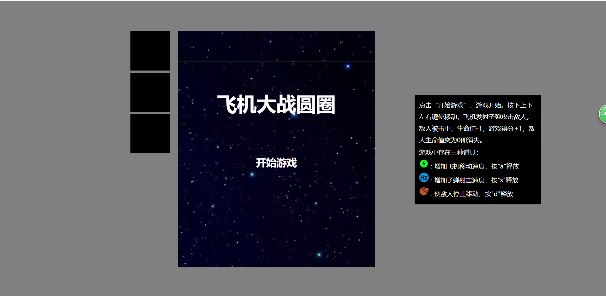
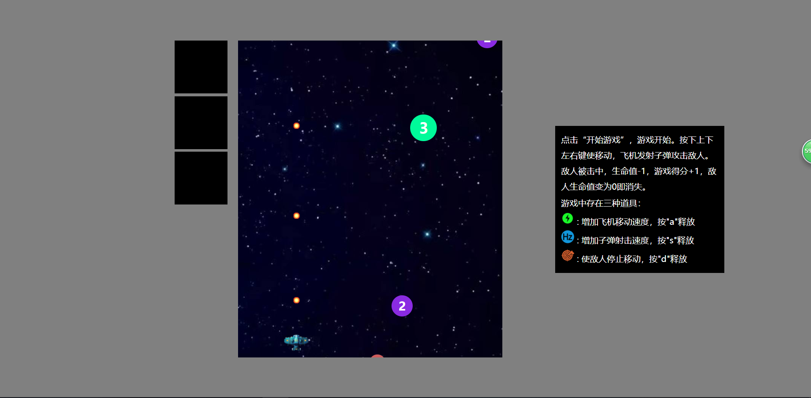
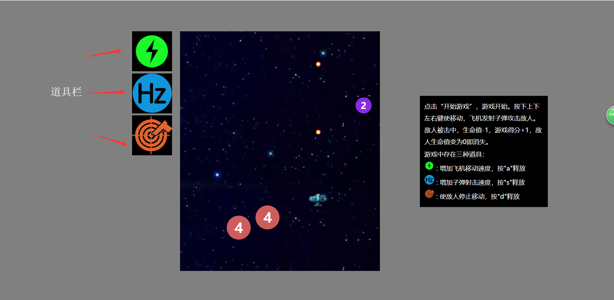
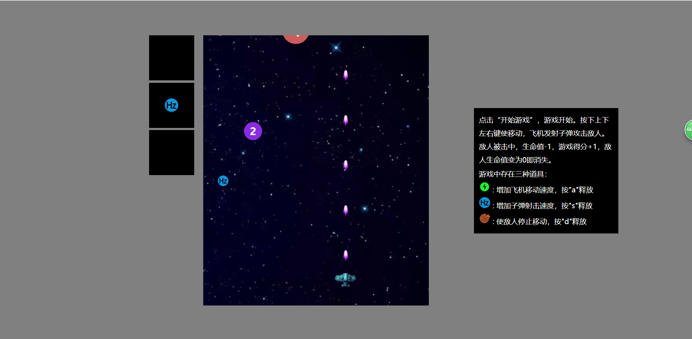
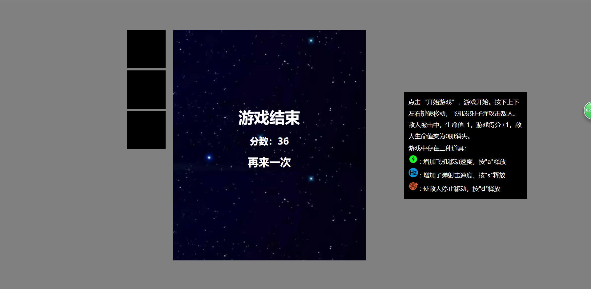

## 项目背景

&emsp;&emsp;最近新学了JavaScript，为了练手写了个游戏——经典老套的的飞机游戏。因为是**JavaScript**写的，所以clone到本地后点击**index.html**即可运行。<a href="www.tewuyiang.cn">在线体验游戏请点击</a>

## 游戏介绍

&emsp;&emsp;这个游戏与传统的飞机大战有许多的相似之处，但是同时也有很多的区别和创新。

&emsp;&emsp;首先，游戏中的敌人不是飞机，而是一些简单的圆圈。圆圈随机地从游戏窗口的上方任意位置出现，并向下移动，碰到游戏框的边缘即会反弹。每个圆圈的中心都有一个随机的生命值，被击中一次，生命值就会减一，同时圆圈的半径也会缩减，直至声明值减小为0，圆圈消失。随着时间的推移，敌人出现的频率会主键提升。

&emsp;&emsp;游戏中的道具和敌人一样，也是随机的出现在游戏窗口的上方，并逐渐向下移动。游戏窗口左边有几个框，分别用来存储不同种类的道具，吃到的道具会在框中显示。每一种道具都有其相应的释放按钮，点击释放按钮后，道具生效，左边道具栏内的道具会逐渐减小，直至消失，道具效果也一并消失。道具出现的频率也会逐渐提高。游戏中的道具分为三种：

* 第一种：提升飞机的速度；
* 第二种：改变子弹的样式，并提升子弹设计频率；
* 第三种：停止游戏窗口内所有敌人的移动；

&emsp;&emsp;游戏中，每击中一次敌人，分数+1，游戏结束后，将显示本次的得分。

## 游戏截图

